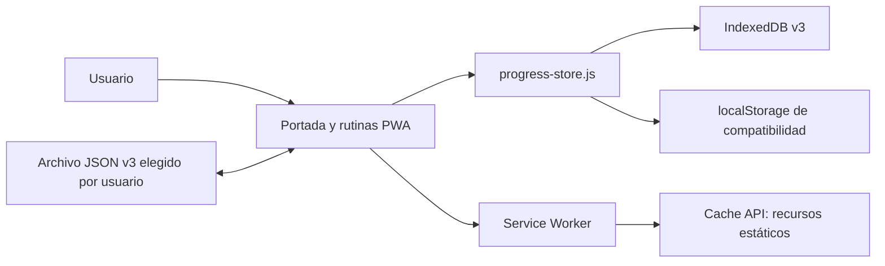

# Arquitectura activa de Gymratik PWA

## Estilo y límites

PWA estática con persistencia local. No hay API de usuario, cuenta, backend de IA, outbox ni réplica entre dispositivos. El Service Worker administra recursos de la aplicación; no transporta ni respalda el historial.

## Responsabilidades

- **Interfaz PWA:** portada, instalación, perfil, sesiones, historial y acceso a las rutinas.
- **Rutinas canónicas:** HTML autónomo, contratos de progreso y medios locales.
- **progress-store.js:** validación y persistencia del perfil, sesiones y snapshots locales; migraciones no destructivas.
- **Service Worker:** preparar inventario estático, servirlo offline y activar versiones según ADR-017.
- **Archivo JSON v3:** exportación/importación manual, validada antes de reemplazar datos.

## Límites de almacenamiento

| Dato | Ubicación | Ciclo de vida |
|---|---|---|
| Portada, rutinas, iconos y medios offline | Cache API | Gestionado por la versión de la PWA |
| Perfil, sesiones e historial | IndexedDB `entrenamiento-progress` v3 | Local al origen y perfil del navegador |
| Fallback y snapshots | localStorage v3 y claves de rutina | Local; no se eliminan en instalación, actualización o rotación semanal |
| Archivo de snapshots anteriores | `gymratik-legacy-progress-archive-v1` en localStorage | Local; agrega capturas previas al renovar la semana |
| Exportación manual | Archivo JSON `gymratik-backup`, esquema 3 | Lo elige y guarda el usuario |

## Actualización y recuperación

1. El worker prepara la nueva versión sin sustituir la versión completa activa.
2. Cuando procede, la nueva versión toma control según la política de red.
3. El código de instalación, actualización y migración conserva el almacén local disponible en el mismo origen.
4. El almacenamiento del origen lo administra el navegador/sistema operativo; la PWA no puede controlar limpiezas externas o todos los flujos de desinstalación.

No existe sincronización automática. El archivo exportado es una representación JSON versionada para traslado o lectura; una importación de reemplazo requiere acción y confirmación manual.

## Decisiones

- [ADR-015](adr/ADR-015-base-local-v3-exclusiva.md): almacén IndexedDB y respaldo local.
- [ADR-017](adr/ADR-017-politica-de-actualizacion-y-cache-pwa.md): actualización de recursos y caché acotada.
- [ADR-018](adr/ADR-018-retencion-manual-de-datos-pwa.md): retención manual y archivo de avances semanales.

Las arquitecturas Android, IA, nube e integraciones descritas en documentos antiguos están diferidas; no aplican a esta vista activa.
